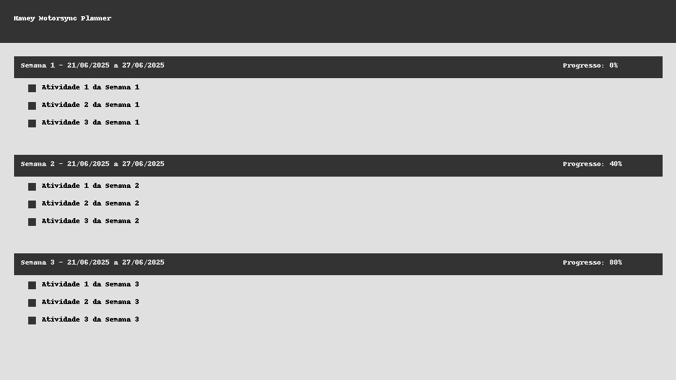

# Haney Planner

Planner interativo desenvolvido em React + Vite para gerenciamento de tarefas semanais de um Tech Challenge fictício. Inspirado em Haney, a mascote da oficina Motorsync 🐾.

## 📦 Estrutura do Projeto

```
├── public/
│   ├── data/
│   │   └── planner_tech_challenge.json
│   └── logo.png
├── src/
│   ├── HaneyPlanner.jsx
│   ├── HaneyPlanner.css
│   └── main.jsx
├── index.html
├── vite.config.js
└── README.md
```



## 🚀 Instruções de Uso

### 1. Instalação
```bash
npm install
```

### 2. Execução
Escolha o ambiente:
```bash
# Desenvolvimento
VITE_ENV=development npm run dev

# Homologação
VITE_ENV=hom npm run dev

# Produção
VITE_ENV=production npm run dev

# Preview
VITE_ENV=preview npm run dev
```

A aplicação será iniciada na porta correspondente ao ambiente:
- `dev` → 3000
- `hom` → 3001
- `prod` → 3002
- `preview` → 3003

### 3. Alteração de Dados
O JSON de planejamento está em `public/data/planner_tech_challenge.json`. O botão **Salvar Progresso** gera um novo `.json` com o status das tarefas.

## 🔄 Deploy no GitHub Pages

### 1. Instale o plugin Vite para GitHub Pages
```bash
npm install --save-dev vite-plugin-gh-pages
```

### 2. Atualize `vite.config.js`
Adicione:
```js
base: '/haney-planner/',
```

### 3. Comando de build e deploy
```bash
npm run build
npx gh-pages -d dist
```

> Certifique-se de configurar seu repositório no GitHub com o nome `haney-planner` ou ajuste o `base` conforme necessário.

## 📄 Licença
MIT
