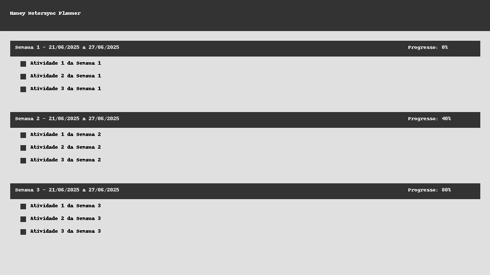

# Haney Planner

Planner interativo desenvolvido em React + Vite para gerenciamento de tarefas semanais de um Tech Challenge fictício. Inspirado em Haney, a mascote da oficina Motorsync 🐾.

## 📦 Estrutura do Projeto

```
├── public/
│   ├── data/
│   │   └── planner_tech_challenge.json
│   └── logo.png
├── src/
│   ├── HaneyPlanner.jsx
│   ├── HaneyPlanner.css
│   └── main.jsx
├── .env.production
├── vite.config.js
├── .github/workflows/deploy-github-pages.yml
├── commit.sh
└── README.md
```



---

## 🚀 Instruções de Uso

### 1. Instalação

```bash
npm install
```

### 2. Execução

```bash
# Ambiente de desenvolvimento
npm run dev
```

> A variável `VITE_ENV` e outras devem estar configuradas no `.env.production`.

### 3. Build de Produção

```bash
npm run build -- --mode production
```

### 4. Servir localmente (simular produção)

```bash
npx serve -s dist
```

---

## 🔧 Alteração de Dados

O arquivo `public/data/planner_tech_challenge.json` armazena as tarefas e percentuais. O botão **Salvar Progresso** salva um novo JSON.

A tela `HaneyPlanner.jsx` já carrega automaticamente o **percentual total** baseado nos dados.

---

## 🚀 Deploy Automático (GitHub Pages)

### 1. Pré-requisitos

- Branch `main` com estrutura correta.
- Arquivo `.env.production` com:

```env
VITE_BASE_PATH=/haney-planner/
```

### 2. GitHub Actions

A action `deploy-github-pages.yml` cuida de:

- Instalação das dependências.
- Build com modo `production`.
- Upload para GitHub Pages.
- Deploy com branches `gh-pages` gerenciadas automaticamente.

---

## 💡 Contribuição via Script

Use o script `commit.sh` para facilitar commits e deploy:

```bash
./commit.sh
```

Este script:
- Solicita o nome da branch (prefixada com `feature/`);
- Pede descrição do commit;
- Faz push, merge automático na `main`;
- Deleta a branch local e remota.

---

## ✅ Ver Online

Acesse:  
🔗 [`https://<usuario>.github.io/haney-planner/`](https://<usuario>.github.io/haney-planner/)

---

## 📄 Licença

MIT
